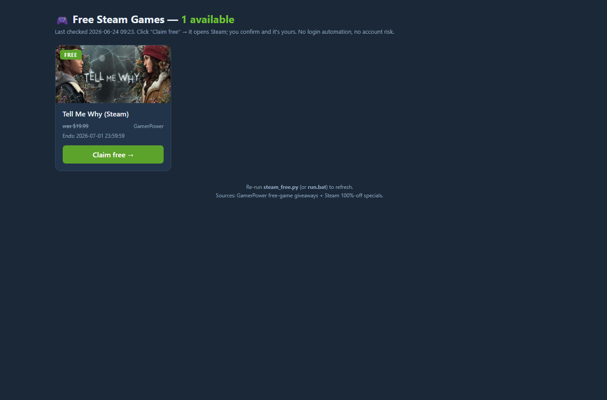

# Steam Free Games Tracker

Finds **free / 100%-off Steam games** and builds a clean, clickable HTML page with one-click
**claim links**. Pure Python standard library — no dependencies, no Steam login.



## Portfolio proof
- [Case study](PORTFOLIO-CASE-STUDY.md) — how a small automation tool turns public APIs into a useful daily dashboard.
- GitHub Actions smoke check compiles the script, validates the CLI help path, and confirms the generated HTML proof file exists.

## Safe by design
It only **reads public data** — it never logs into your Steam account and never automates
purchases, so there's **zero account-ban risk**. You click "Claim free", Steam opens, you confirm,
and the game is yours (a couple of seconds). *(Full auto-claiming requires automating your logged-in
account, which violates Steam's terms and can get you banned — this tool deliberately doesn't do that.)*

## Usage
```bash
python steam_free.py            # fetch, build the page, and open it
python steam_free.py --no-open  # build the page without opening a browser
```
Or just **double-click `run.bat`** (Windows).

The generated page is saved in the current working directory. Browser opening supports
paths containing spaces, `#`, and `%`; the Windows launchers use their own folder.

Run `python -m unittest -v` for offline regression checks of file links and browser-opening
flags. Tests use synthetic games and mock the browser; they do not contact either API.

## What it does
1. Pulls free-to-keep **Steam giveaways** from the GamerPower API (title, value, end date, claim link).
2. Pulls Steam's own **specials** and keeps the ones at **100% off** (free right now).
3. De-duplicates, sorts by end date, and writes `steam-free-games.html` — a card grid with claim buttons.

## Keep it automatic (optional)
Use **Windows Task Scheduler** to run `run.bat` once a day, and you'll always have a fresh
`steam-free-games.html` of everything free — never miss a giveaway.

For account-level auto-claiming, read `AUTO-CLAIM-SETUP.md` first. It explains the limits, risk,
and why this tracker itself stays read-only.

## Tech
Standard-library only (`urllib`, `json`, `html`): fetches two public APIs, merges/dedupes, and
generates a self-contained HTML page. No `pip install`, no keys.

## License
MIT © Rolly Calma ([Ghraven](https://github.com/Ghraven))
